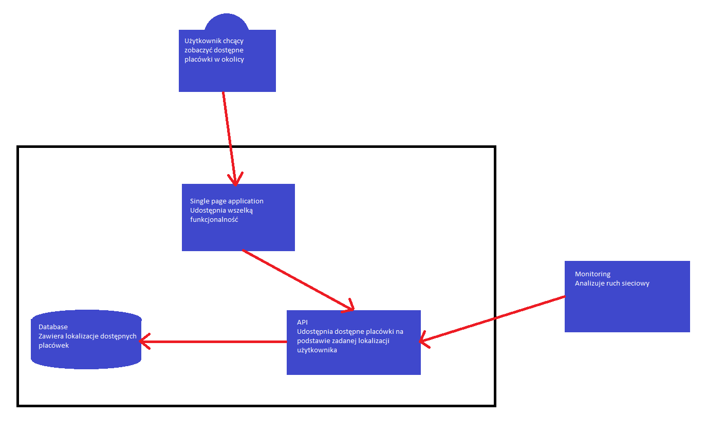

# GCP-Project

# Opis
Projekt polegał na implementacji prostej strony internetowej, która na podstawie lokalizacji użytkownika będzie wyświetlała dostępne placówki w okolicy (restauracje, serwisy, biblioteki, szpitale, itp).
W tym celu udostępniona zostałą baza SQL zawierająca konkretne placówki, które w zależności od położenia użytkownika są odczytywane przez dedykowane API.

Projekt jest dostępny do wglądu pod tym adresem.

# Architektura

