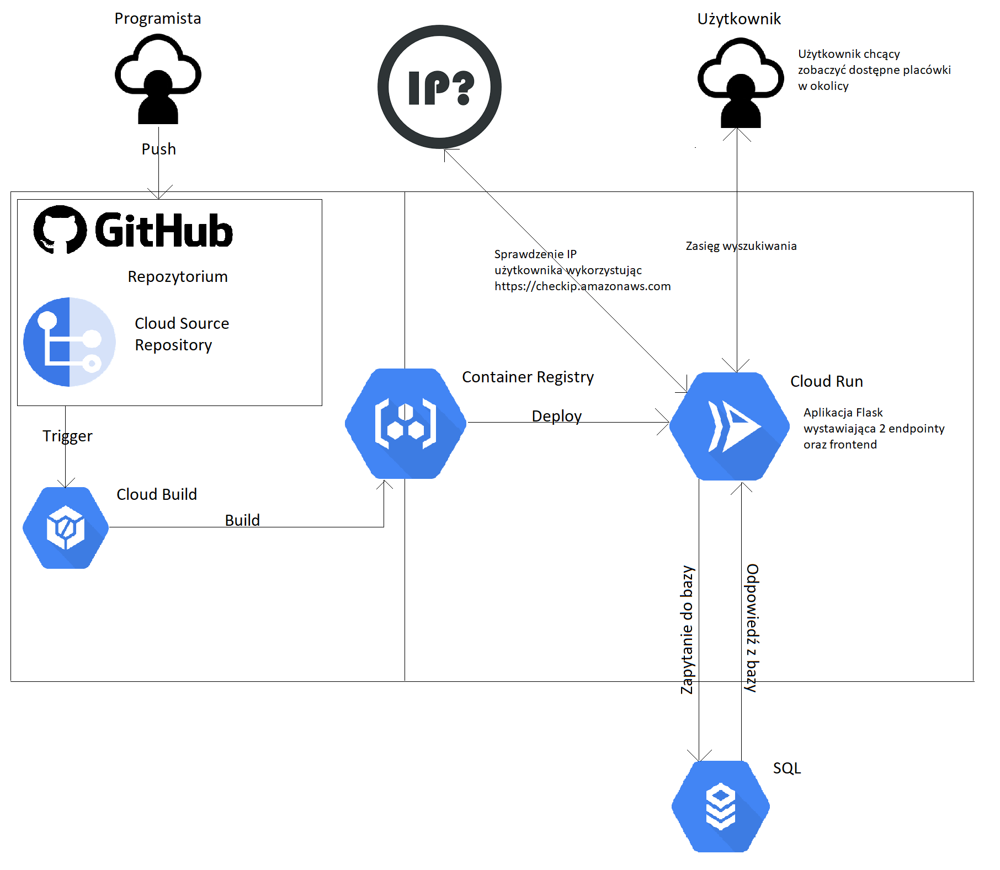

# GCP-Project

Projekt będzie polegał na implementacji prostej strony internetowej, która na podstawie lokalizacji użytkownika będzie wyświetlała dostępne placówki w okolicy (restauracje, serwisy, biblioteki, szpitale, itp).
W tym celu dostępna będzie baza (NoSQL) zawierająca konkretne placówki, które w zależności od położenia użytkownika będą odczytywane przez dedykowane API.
Całość projektu będzie stawiana za pomocą Terraform'u, a ruch generowany na stronie monitorowany będzie przez narzędzia udostępnione przez Google Cloud.

